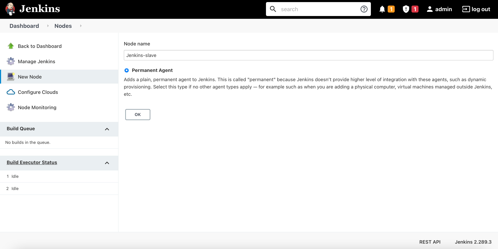
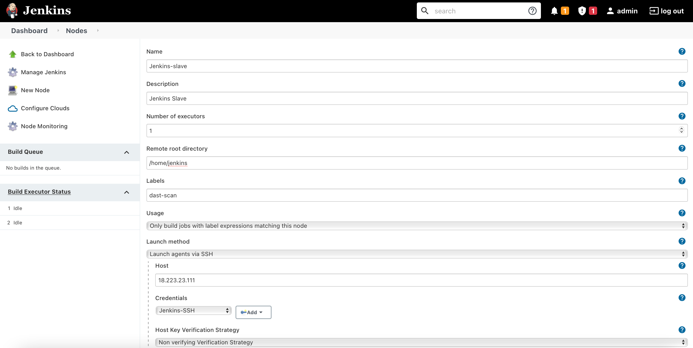

### **Objective**

The aim of this section is to shift the entire setup from local machine to AWS Cloud and solve the 10th point of the [Problem Statement](problem_statements.md) under Task 1.

About AWS

- Amazon Web Services (AWS) is the world's most comprehensive and broadly adopted cloud platform, offering over 200 fully featured services from data centers globally.  
- Migrating your local/on-prem infrastructure to cloud can help reduce costs of operations, increase IT staff productivity, and reduce downtime.

### **Starting EC2 Instances**

Amazon Elastic Compute Cloud (Amazon EC2) is a web service that provides secure, resizable compute capacity in the cloud. It is a service that enables business subscribers to run application programs in the computing environment. It can serve as a practically unlimited set of VMs. 

An EC2 instance is a virtual server in Amazon's EC2 for running applications on the AWS infrastructure. Instances are created from Amazon Machine Images (AMI). AMIs are like templates that are configured with an OS, CPU power, memory, storage and other networking resources to suit user needs.

Steps to create an EC2 instance:

1. Create an AWS account on [https://aws.amazon.com](https://aws.amazon.com). 
2. After logging in to your account, select `All Services` and under the `Compute` section, click `EC2` in the `AWS Management Console` page. You will be redirected to `EC2 Management Console`
3. Select `Launch EC2 instance`.
4. Select AMI of your choice, add security group (firewall rules) and SSH key pair. When adding key pair, the browser will automatically ask to download the private key file. Keep the file safe in directory of your choice. You will need it to establish an SSH connection with the instance.
5. After launch, wait till the instance is up and running.
6. SSH into the instance using the following command. 

        ssh -i /path/to/private-key instance-username@instance-IP-address

    To get the instance-username for SSH login based on your instance OS/distro, refer this [documentation](https://alestic.com/2014/01/ec2-ssh-username/). For an Ubuntu instance, the username is `ubuntu`.

7. Create three instances; Jenkins server (master), DAST server (agent), Production server. 


### **Setup Jenkins Server**

A Jenkins server is setup to automate the software development life cycle using CI/CD pipelines. DVNA NodeJs application which is to be deployed on Production server will first undergo multiple security testing in the Jenkins server prior to deployment.   

**Note:** Initially, I tried running all the scans in Jenkins instance via pipeline. But the instance crashed/hung when running the OWASP ZAP scan. Since I'm using a Free Tier version of AWS, I can only use 1GB memory instances, which isn't sufficient to run all these scans. To solve this issue, I'm using a Master-Agent architecture in which the DAST scan will be allocated to an Agent (separate instance). The Master-Agent architecture of Jenkins is used for distributed build environments, where the workload of building projects is distributed to multiple agent nodes or slaves.

Create two EC2 instances for Jenkins. The `Master` instance is the main Jenkins server which will also perform static analysis on test DVNA, while the `Agent` instance will be used to perform DAST scan on test DVNA deployed on Master.

### **Jenkins Master**

In the Jenkins Master instance, run the following `install.sh` script to automate the installation process of Jenkins, Docker and static analysis tools. 

```bash
#!/bin/bash
sudo apt update

# Install Java
sudo apt install -y default-jre default-jdk unzip

# Install Jenkins
wget -q -O - https://pkg.jenkins.io/debian-stable/jenkins.io.key | sudo apt-key add - &&
sudo sh -c 'echo deb http://pkg.jenkins.io/debian-stable binary/ > /etc/apt/sources.list.d/jenkins.list' &&
sudo apt update &&
sudo apt install -y jenkins &&
sudo systemctl start jenkins

# Install Docker
sudo curl -fsSL https://get.docker.com -o get-docker.sh &&
sudo sh get-docker.sh &&
sudo usermod -aG docker jenkins

# Install Python3 and Pip3
sudo apt install -y python3-pip

# Install NodeJs and NPM
sudo curl -sL https://deb.nodesource.com/setup_14.x | sudo -E bash - &&
sudo apt install -y nodejs 

# Install NodeJsScan (SAST)
sudo pip3 install njsscan

# Install AuditJS (SAST)
sudo npm install -g auditjs

# Install OWASP Dependency-Check (SCA)
cd /var/lib/jenkins && 
wget -P ./ https://github.com/jeremylong/DependencyCheck/releases/download/v6.2.2/dependency-check-6.2.2-release.zip &&
wget -P ./ https://github.com/jeremylong/DependencyCheck/releases/download/v6.2.2/dependency-check-6.2.2-release.zip.asc &&
sudo unzip ./dependency-check-6.2.2-release.zip

# Install CycloneDX (SBoM)
sudo npm install -g @cyclonedx/bom

# Install JSHint (Code Linting)
sudo npm install -g jshint

# Install ESLint (Code Linting)
# Note: To use eslint, manually create a .eslintrc.json file in the `jenkins` home directory.
# Copy the file content from documentation
sudo npm install -g eslint
```

**Note:** Run the script using `sudo sh install.sh`  

Next, create a `.eslintrc.json` config file to run ESLint scan.

```bash
{
    "env": {
        "browser": true,
        "commonjs": true,
        "es2021": true
    },
    "extends": "eslint:recommended",
    "parserOptions": {
        "ecmaVersion": 12
    },
    "rules": {
    }
}
```

After the installation process is complete, we need to enable SSH communication between Master and Agent. Create SSH keys in `jenkins` user home directory. 

```bash
sudo su - jenkins
ssh-keygen -t ed25519
```

The public and private SSH keys are stored in `<Jenkins-Home-Dir>/.ssh` directory.

### Configuring Static Analysis Tools

The `install.sh` bash script executed previously installs all the tools required to perform scans on a NodeJs application (DVNA). 

**SAST Tools**

For SAST, I followed the [documentation](static_analysis.md) I wrote previously. I added the same stage in the pipeline, as the one I used in my local setup. The SAST tools used are:

- NodeJsScan
- AuditJs
- OWASP Dependency-Check

**Code Analysis Tools**

For code quality analysis, I followed the [documentation](scqa.md) I wrote previously. I added the same stage in the pipeline, as the one I used in my local setup. The code linting tools used are:

- JSHint
- ESLint

**Software Bill of Marterials**

For generating SBoM, I followed the [documentation](sbom.md) I wrote previously. I added the same stage in the pipeline, as the one I used in my local setup. The SBoM tool used is:

- CycloneDX

### **Jenkins Agent/Slave**

The Jenkins agent instance will be used to perform DAST scan on DVNA running on Master. Run the following bash script after logging into the instance.

```bash
#!/bin/bash
sudo apt update

# Install Java
sudo apt install -y default-jre default-jdk

# Install Docker
sudo curl -fsSL https://get.docker.com -o get-docker.sh &&
sudo sh get-docker.sh
```

To work with this instance from pipeline, we will be creating a new user - `jenkins`. Add this user to `docker` group to enable running docker containers without sudo.

```bash
sudo adduser jenkins
sudo usermod -aG docker jenkins
```

Change to user `jenkins` and create a `.ssh` directory in its home directory. 

```bash
sudo su - jenkins
ssh jenkins@localhost
touch ~/.ssh/authorized_keys
```

To allow SSH connection from Master to Agent, copy the public key of Master instance into `~/.ssh/authorized_keys` created in Agent.

### Configuring Dynamic Analysis Tool - OWASP ZAP

For reasons mentioned earlier, The ZAP scan is run on the Jenkins Agent. Docker installation is the only requirement to run the ZAP scan. I added the same stage in the pipeline, as the one I used in my local setup (mentioned in the [documentation](dynamic_analysis.md)). However, I specified the `agent` to run the scan using a label. To work with Master-Agent architecture, labels can be used to allocate jobs to certain agents.  
**Note:** The [`Setup Master-Agent`](aws.md/#setup-master-agent)) section gives details on creating node with label.

```bash
stage('OWASP ZAP Analysis') {
  agent {
    label 'dast-scan'
  }
  steps {
    sh 'docker run --rm -i -u zap --name owasp-zap -v ~/:/zap/wrk/ owasp/zap2docker-stable zap-baseline.py -t http://3.143.222.142:9090 -r zap-report.html -l PASS || true'
  }
}
```


### **Setup Production Server**

Install docker on the production server the same way you installed it on the Jenkins server (you can just run the bash script below).

```bash
#!/bin/bash
sudo apt update

# Install Docker
sudo curl -fsSL https://get.docker.com -o get-docker.sh &&
sudo sh get-docker.sh
```

To work with this instance from pipeline, we will be creating a new user - `jenkins`. Add this user to `docker` group to enable running docker containers without sudo.

```bash
sudo adduser jenkins
sudo usermod -aG docker jenkins
```

Change to user `jenkins` and create a `.ssh` directory in its home directory. 

```bash
sudo su - jenkins
ssh jenkins@localhost
touch ~/.ssh/authorized_keys
```

To allow SSH connection from Jenkins Master to Production, copy the public key of Master instance into `~/.ssh/authorized_keys` created in Production.

The instances have now been successfully setup!

### **Setup Master-Agent**

1. Go to `Dashboard` -> `Manage Jenkins` -> `Manage Nodes and Clouds` -> `New Node`.
2. Give a name to the node (`Jenkins Slave` in my case) and select `Permanent agent`.  
        
    

3. Provide details about the agent.

    - Description - Description of the agent
    - Number of executors - The maximum number of concurrent builds that Jenkins may perform on this node (default is 1).
    - Remote root directory - Provide the directory in the agent instance dedicated to Jenkins (`/home/jenkins`, in my case)
    - Labels - Give label name (`dast-scan`, in my case) which can be used to specify stage(s) to use this agent instead of the master node.
    - Usage - I selected `Only build jobs with label expressions matching this node` because I only want this agent to be used when its label expression is specified in the project. 
    - Launch Method - Chose `Launch agents via SSH` and provided IP of agent instance and credentials required to log on to the instance. 
    - Availability - Selected the default option of `Keep this agent online as much as possible`.  
    Now, click `Save`.

    

4. Create a new project (I selected `Pipeline`) and in the `Configure` section, specify the Git repo containing the Jenkinsfile.
5. Click `Build Now` to execute the pipeline.

### **Pipeline**

```bash
pipeline {
  agent any
  
  stages {
    stage ('Initialization') {
      steps {
        sh 'echo "Starting the build!"'
      }
    }
    
    stage ('Build') {
      environment {
        MYSQL_USER="dvna"
        MYSQL_DATABASE="dvna"
        MYSQL_PASSWORD="passw0rd"
        MYSQL_RANDOM_ROOT_PASSWORD="yes"
        MYSQL_HOST="mysql-db"
        MYSQL_PORT=3306
      }
      steps {
        sh 'echo "MYSQL_USER=$MYSQL_USER\nMYSQL_DATABASE=$MYSQL_DATABASE\nMYSQL_PASSWORD=$MYSQL_PASSWORD\nMYSQL_RANDOM_ROOT_PASSWORD=$MYSQL_RANDOM_ROOT_PASSWORD\nMYSQL_HOST=$MYSQL_HOST\nMYSQL_PORT=$MYSQL_PORT" > ~/vars.env'
        sh 'docker run --rm -d --name dvna-mysql --env-file ~/vars.env mysql:5.7 tail -f /dev/null'
        sh 'docker run --rm -d --name dvna-app --env-file ~/vars.env --link dvna-mysql:mysql-db -p 9090:9090 appsecco/dvna'
        sh 'docker cp dvna-app:/app/ ~/ && mkdir ~/reports && chmod 777 ~/reports'        
      }
    } 
    
    stage('NodeJsScan Analysis') {
      steps {
        sh 'njsscan --json -o ~/reports/nodejsscan-report ~/app || true'
      }
    }

    stage('Auditjs Analysis') {
      steps {
        sh 'cd ~/app; auditjs ossi > ~/reports/auditjs-report || true'
      }
    }

    stage ('OWASP Dependency-Check Analysis') {
      steps {
        sh '~/dependency-check/bin/dependency-check.sh --scan ~/app --out ~/reports/dependency-check-report --format JSON --prettyPrint || true'
      }
    }
    
    stage('OWASP ZAP Analysis') {
      agent {
        label 'dast-scan'
      }
      steps {
        sh 'docker run --rm -i -u zap --name owasp-zap -v ~/:/zap/wrk/ owasp/zap2docker-stable zap-baseline.py -t http://3.143.222.142:9090 -r zap-report.html -l PASS || true'
      }
    }
    
    stage ('Retrieve ZAP report from Agent'){
        steps {
            sh 'scp jenkins@3.143.222.142:~/zap-report.html ~/reports'
        }
    }

    stage ('Generating Software Bill of Materials') {
      steps {
        sh 'cd ~/app && cyclonedx-bom -o ~/reports/sbom.xml'
      }
    }
    
    stage ('JSHint Analysis') {
      steps {
        sh 'jshint $(find ~/app -type f -name "*.js" -o -name "*.ejs" | grep -v node_modules) > ~/reports/jshint-report || true'
      }
    }
    
    stage ('ESLint Analysis') {
      steps {
        sh 'eslint -c ~/.eslintrc.json -f html --ext .js,.ejs -o ~/reports/eslint-report.html ~/app || true'
      }
    }
    
    stage ('Remove DVNA from Jenkins') {
      steps {
        sh 'rm -rf ~/app'
        sh 'docker stop dvna-app && docker stop dvna-mysql'
        sh 'docker rmi appsecco/dvna'
      }
    }
    
    stage ('Deploy DVNA to Production') {
      steps {
        sh 'ssh -o StrictHostKeyChecking=no jenkins@18.222.182.128 "docker stop dvna-app && docker stop dvna-mysql && docker rm dvna-app && docker rm dvna-mysql && docker rmi appsecco/dvna || true"'
        sh 'scp ~/vars.env jenkins@18.222.182.128:~/'
        sh 'ssh -o StrictHostKeyChecking=no jenkins@18.222.182.128 "docker run -d --name dvna-mysql --env-file ~/vars.env mysql:5.7 tail -f /dev/null"'
        sh 'ssh -o StrictHostKeyChecking=no jenkins@18.222.182.128 "docker run -d --name dvna-app --env-file ~/vars.env --link dvna-mysql:mysql-db -p 9090:9090 appsecco/dvna"'
      }
    }

  }
}
```