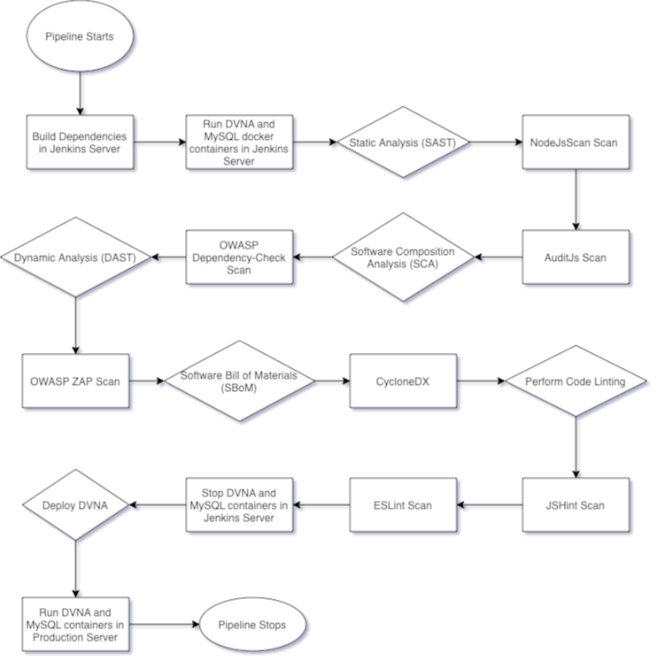

## **Objective**

The aim of this section is to show the complete CI/CD pipeline structure and solve the points 1-8 in [Problem Statement](problem_statements.md) under Task 1.

---

### **Complete Pipeline**

&nbsp;

The following is the complete pipeline to perform multiple scans on the application and then deploy it in Production VM.

```bash
pipeline {
  agent any
  
  stages {
    stage ('Initialization') {
      steps {
        sh 'echo "Starting the build!"'
      }
    }
    
    stage ('Build') {
      environment {
        MYSQL_USER="dvna"
        MYSQL_DATABASE="dvna"
        MYSQL_PASSWORD=<PASSWORD>
        MYSQL_RANDOM_ROOT_PASSWORD=<YES_OR_NO>
        MYSQL_HOST="mysql-db"
        MYSQL_PORT=3306
      }
      steps {
        sh 'echo "MYSQL_USER=$MYSQL_USER\nMYSQL_DATABASE=$MYSQL_DATABASE\nMYSQL_PASSWORD=$MYSQL_PASSWORD\nMYSQL_RANDOM_ROOT_PASSWORD=$MYSQL_RANDOM_ROOT_PASSWORD\nMYSQL_HOST=$MYSQL_HOST\nMYSQL_PORT=$MYSQL_PORT" > ~/vars.env'
        sh 'docker run --rm -d --name dvna-mysql --env-file ~/vars.env mysql:5.7 tail -f /dev/null'
        sh 'docker run --rm -d --name dvna-app --env-file ~/vars.env --link dvna-mysql:mysql-db -p 9090:9090 appsecco/dvna'
        sh 'docker cp dvna-app:/app/ ~/ && mkdir ~/reports && chmod 777 ~/reports'        
      }
    } 
       
    stage('NodeJsScan Analysis') {
      steps {
        sh 'njsscan --json -o ~/reports/nodejsscan-report ~/app || true'
      }
    }
    
    stage('Auditjs Analysis') {
      steps {
        sh 'cd ~/app; auditjs ossi > ~/reports/auditjs-report || true'
      }
    }

    stage ('OWASP Dependency-Check Analysis') {
      steps {
        sh '~/dependency-check/bin/dependency-check.sh --scan ~/app --out ~/reports/dependency-check-report --format JSON --prettyPrint || true'
      }
    }
    
    stage('OWASP ZAP Analysis') {
      steps {
        sh 'docker run --rm -i -u zap --name owasp-zap -v ~/reports/:/zap/wrk/ owasp/zap2docker-stable zap-baseline.py -t http://192.168.56.101:9090 -r zap-report.html -l PASS || true'
      }
    }
    
    stage ('Generating Software Bill of Materials') {
      steps {
        sh 'cd ~/app && cyclonedx-bom -o ~/reports/sbom.xml'
      }
    }
    
    stage ('JSHint Analysis') {
      steps {
        sh 'jshint $(find ~/app -type f -name "*.js" -o -name "*.ejs" | grep -v node_modules) > ~/reports/jshint-report || true'
      }
    }
    
    stage ('ESLint Analysis') {
      steps {
        sh 'eslint -c ~/.eslintrc.json -f html --ext .js,.ejs -o ~/reports/eslint-report.html ~/app || true'
      }
    }
    
    stage ('Remove DVNA from Jenkins') {
      steps {
        sh 'rm -rf ~/app'
        sh 'docker stop dvna-app && docker stop dvna-mysql'
        sh 'docker rmi appsecco/dvna && docker rmi mysql:5.7'
      }
    }
    
    stage ('Deploy DVNA to Production') {
      steps {
        sh 'ssh -o StrictHostKeyChecking=no tariq@192.168.56.102 "docker stop dvna-app && docker stop dvna-mysql && docker rm dvna-app && docker rm dvna-mysql && docker rmi appsecco/dvna || true"'
        sh 'scp ~/vars.env tariq@192.168.56.102:~/'
        sh 'ssh -o StrictHostKeyChecking=no tariq@192.168.56.102 "docker run -d --name dvna-mysql --env-file ~/vars.env mysql:5.7 tail -f /dev/null"'
        sh 'ssh -o StrictHostKeyChecking=no tariq@192.168.56.102 "docker run -d --name dvna-app --env-file ~/vars.env --link dvna-mysql:mysql-db -p 9090:9090 appsecco/dvna"'
      }
    }

  }
}
```


