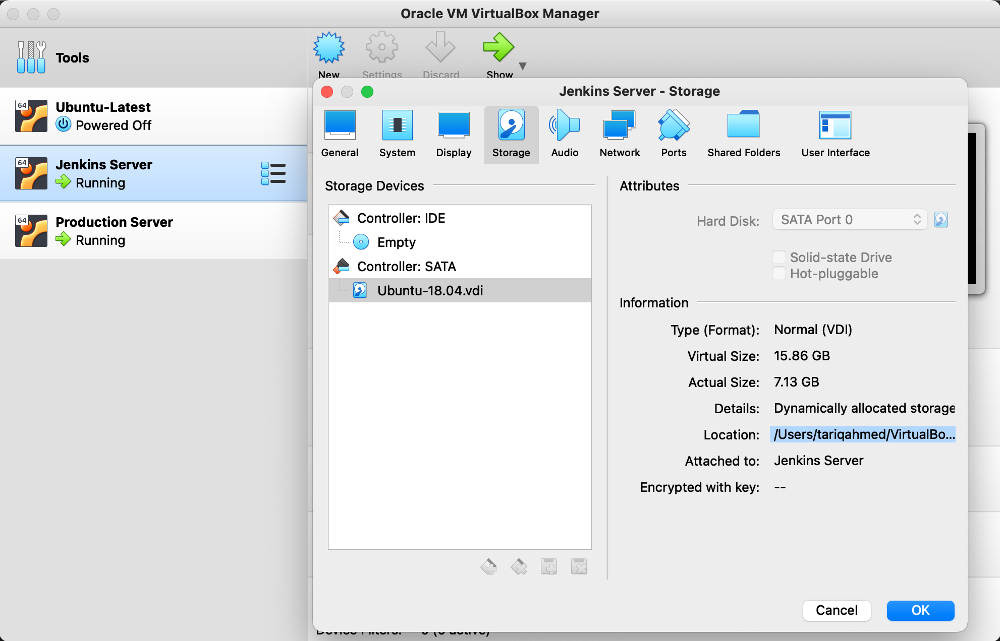

## **Objective**

The aim of this section is to perform dynamic analysis using DAST tools on DVNA.

About DAST

- Dynamic analysis is done while an application is running. 
- DAST tools include OWASP Zed Attack Proxy (ZAP) and W3AF.


### **OWASP ZAP**

Implementing ZAP analysis with docker is simpler and faster than manual installation. I followed this [documentation](https://www.zaproxy.org/docs/docker/about/). First, pull the ZAP image from docker hub.
```bash
sudo docker pull owasp/zap2docker-stable
```

TRIED THIS! It Didnt Work!

Create a docker network for both application container and zap container to run in.
```bash
sudo docker network create zapnet
```

```bash
sudo docker run -u zap -td --name owasp-zap --net zapnet -p 8090:8090 owasp/zap2docker-stable zap.sh -daemon -port 8090 -host 0.0.0.0 -config api.disablekey=true

sudo docker exec owasp-zap zap-cli open-url http://192.168.56.102:9090

sudo docker exec owasp-zap zap-cli active-scan http://192.168.56.102:9090
```


FINAL SOLUTION

The baseline-scan script is intended to be ideal to run in a CI/CD environment, even against production sites.
Docker flags used

- --rm, remove container after completion
- -d, run as a background job
- -u <user>, specify user to run container as
- -v 'host dir':'container dir', mount volumes

Zap CLI flags used

- -t 'target', specify target to scan
- -r 'file.html', generate an HTML output report
- -l level, minimum level to show: PASS, IGNORE, INFO, WARN or FAIL.

```bash
sudo docker run --rm -td -u zap --name owasp-zap -v ~/:/zap/wrk/ owasp/zap2docker-stable zap-baseline.py -t http://192.168.56.102:9090 -r owasp-zap-report.html -l PASS
```

To run a fullscan script, run the following command
```bash
sudo docker run --rm -td -u zap --name owasp-zap -v ~/:/zap/wrk/ owasp/zap2docker-stable zap-full-scan.py -t http://192.168.56.102:9090 -r owasp-zap-report.html -l PASS
```

The report `owasp-zap-report.html`, generated on successful completion, will be located in the users home directory.

**Note:** To open .html file in browser from terminal, type `open owasp-report.html` from host terminal.


### **DAST Pipeline**

As we've already seen in [Setup of Production Server](production_setup.md), DVNA is deployed in a docker container. To perform DAST on DVNA, the application will run in a docker container and the DAST tool will run in another container (as shown earlier in this section). To work with docker containers via Jenkins pipeline, you'll need to add `jenkins` user to group `docker` to run docker commands without sudo.

```bash
sudo usermod -aG docker jenkins
sudo reboot
```


```bash
pipeline {
  agent any
  stages {
    stage ('Initialization') {
      steps {
        sh 'echo "Starting the build!"'
      }
    }
    
    stage('Copy Application Code') {
      steps {
        sh 'ssh -o StrictHostKeyChecking=no tariq@192.168.56.102 "docker start dvna-mysql && docker start dvna-app; docker cp dvna-app:/app/ ~/;"'
        sh 'scp -rC tariq@192.168.56.102:~/app ~/ && mkdir -p ~/report'
      }
    }
    
    stage('NodeJsScan') {
      steps {
        sh 'njsscan --json -o ~/report/nodejsscan-report ~/app || true'
      }
    }
    
    stage('Auditjs') {
      steps {
        sh 'cd ~/app; auditjs ossi > ~/report/auditjs-report || true'
      }
    }

    stage ('OWASP Dependency-Check') {
      steps {
        sh '~/dependency-check/bin/dependency-check.sh --scan ~/app --out ~/report/dependency-check-report --format JSON --prettyPrint || true'
      }
    }

    stage('ZAP Scan') {
      steps {
        sh 'docker run --rm -td -u zap --name owasp-zap -v ~/report/:/zap/wrk/ owasp/zap2docker-stable zap-baseline.py -t http://192.168.56.102:9090 -r zap-report.html -l PASS'
        sh 'docker logs --follow owasp-zap'
      }
    }

    stage ('Final') {
      steps {
        sh 'ssh -o StrictHostKeyChecking=no tariq@192.168.56.102 "docker stop dvna-app && docker stop dvna-mysql;"'
        sh 'rm -rf ~/app'
        sh 'echo "Scan successfully completed!"'
      }
    }

  }
}
```


### **Increase VM Disk Space**
While trying to run the Jenkins pipeline, I noticed there was an error during the ZAP scan. On reviewing the container logs, I realized that my VM was out of disk space. So instead of creating a new VM with more disk space (I was currently using the default 10GB), I decided to increase the disk space of the Jenkins VM to 16GB.

I followed this [documentation](https://ourcodeworld.com/articles/read/1434/how-to-increase-the-disk-size-of-a-dynamically-allocated-disk-in-virtualbox). Get location of your Jenkins VM virtual hard disk. Go to `Oracle VM VirtualBox Manager` -> `Jenkins Server` -> `Settings` -> `Storage` -> `Controller: IDE`.

<br>

**Increase Disk Size**

To increase size of virtual disk, type the following command in the terminal (for Linux/MaxOS).

```bash
VBoxManage  modifyhd --resize <NEW-SIZE> <LOCATION-OF-VDI-IMAGE>
```

Check if size changed successfully.

```bash
VBoxManage showhdinfo <LOCATION-OF-VDI-IMAGE> | grep Capacity
```

**Boot from GParted on your VM**

I followed the same steps as mentioned in the `Boot from GParted on your VM` section of the [documentation](https://ourcodeworld.com/articles/read/1434/how-to-increase-the-disk-size-of-a-dynamically-allocated-disk-in-virtualbox). Even after having followed all the steps, the partition was still not set properly. I found the solution to this problem [here](https://askubuntu.com/questions/1106795/ubuntu-server-18-04-lvm-out-of-space-with-improper-default-partitioning).

In the Jenkins VM, resize the logical volume to use all the existing and free space of the volume group.
```bash
sudo lvm

lvm> lvextend -l +100%FREE /dev/ubuntu-vg/ubuntu-lv
lvm> exit
```

After the command above is successful, resize the file system to use the new available space in the logical volume.
```bash
sudo resize2fs /dev/ubuntu-vg/ubuntu-lv
```

Check if the available space has increased.
```bash
df -h
```


