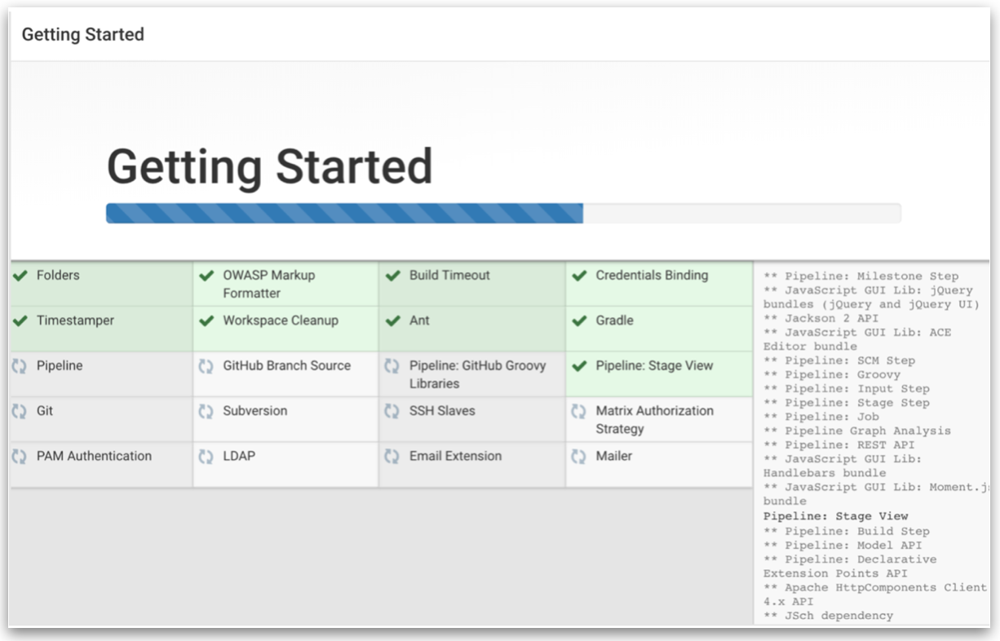
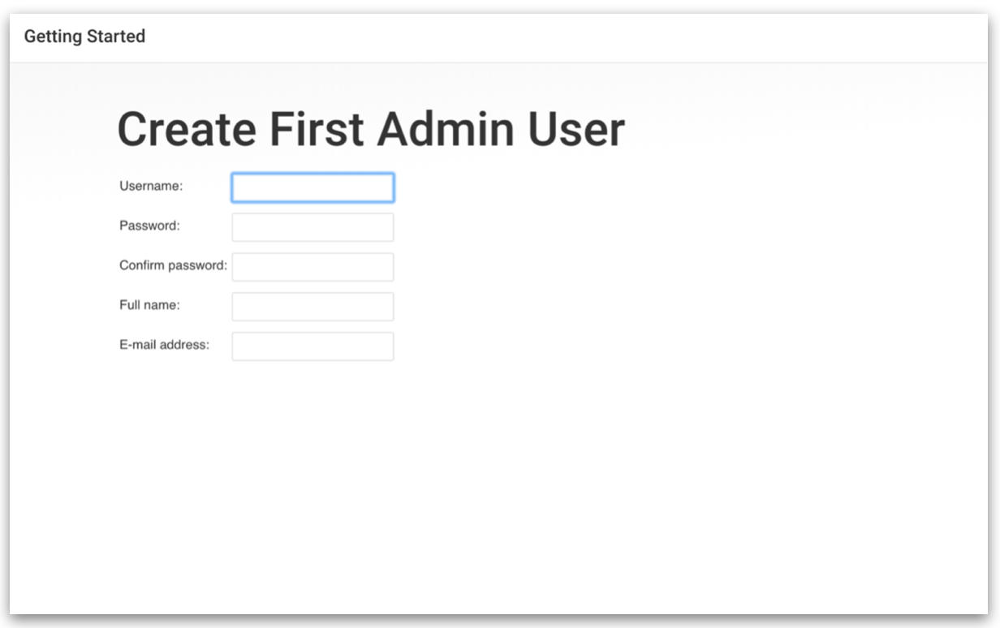

## **Objective**

The aim of this section is to set up a Jenkins server for building various CI/CD pipelines.

About Jenkins

- Jenkins is a Java-based open-source automation software. 
- It automates the repetitive technical tasks involved in the continuous integration and delivery of software

Prerequisites

- VM running Ubuntu 18.04 LTS.
- Java version 8. OpenJDK version 11.

### **Step 1 - Install Java**

The easiest option for installing Java is to use the version packaged with Ubuntu. By default, Ubuntu 18.04 includes OpenJDK version 11, which is an open-source variant of the JRE and JDK.

Install the default Java Runtime Environment (JRE) from OpenJDK 11.

```bash
$ sudo apt install default-jre 

$ java --version   # OpenJDK version
```


Next, install Java Development Kit (JDK) in order to compile and run some specific Java-based software

```bash
$ sudo apt install default-jdk

$ javac --version  # Java Compiler version
```

### **Step 2 - Install Jenkins**

First, add the repository key to the system. On success, the system will return "OK".

```bash
wget -q -O - <https://pkg.jenkins.io/debian-stable/jenkins.io.key> | sudo apt-key add -
```

Next, append the Debian package repository address to the server’s sources.list file.

```bash
sudo sh -c 'echo deb <http://pkg.jenkins.io/debian-stable> binary/ > /etc/apt/sources.list.d/jenkins.list'

sudo apt update
```

Install Jenkins and its dependencies

```bash
sudo apt install jenkins
```

### **Step 3 - Start Jenkins Service**

After all the installation steps, start Jenkins using systemctl. You can view the status of the service, using the 2nd command shown below.

```bash
sudo systemctl start jenkins

sudo systemctl status jenkins
```

### **Step 4 - Adding Firewall Rules**

Jenkins uses port 8080 by default. Hence, we'll allow traffic to port 8080 by adding a firewall rule using ufw (uncomplicated firewall).

```bash
sudo ufw allow 8080
sudo ufw allow OpenSSH # Allow SSH access into the server over the internet
sudo ufw enable # Starts the firewall service
sudo ufw status # Shows all firewall rules
```

### **Step 5 - Setting Up Jenkins**

To set up your installation, visit Jenkins on its default port, 8080, using your server domain name or IP address: http://<your_server_ip_or_domain>:8080. The 'Unlock Jenkins' page asks for administrator password.  
&nbsp;

This password is present in the /var/lib/jenkins/secrets/initialAdminPassword file. Copy and paste the admin password from that file.
```
sudo cat /var/lib/jenkins/secrets/initialAdminPassword
```

You will be given a choice to install suggested plugins or select your own plugins (I chose to install the suggested plugins).

&nbsp;

After the installation of plugins is complete, you will be prompted to create admin user. You can either create your own, or continue with the default admin.
&nbsp;
&nbsp;

You will see an 'Instance Configuration' page that will ask you to confirm the preferred URL for your Jenkins instance. After confirming the appropriate information, click Save and Finish. You will see a confirmation page confirming that “Jenkins is Ready!”


**Note:**

If you had moved forward with the default admin and not created a custom admin user, when logging in, username="admin" and password="<password in `initialAdminPassword` file>". You can change the admin password from `Dashboard` → `Admin` → `Configure`