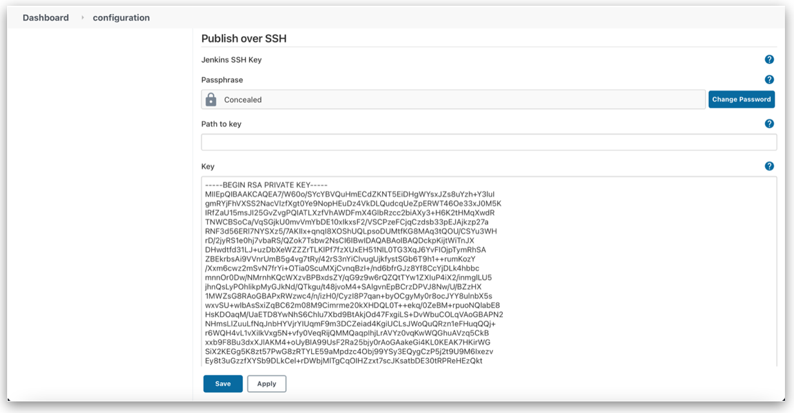

## **Objective**

The aim of this section is to enable SSH communication between the two VMs as part of the solution to 1st point of the `[Problem Statement](problem_statements.md)` under Task 1.

About SSH

-   SSH provides a secure encrypted channel between two hosts over an insecure network.
-   This connection can also be used for terminal access, file transfers, and for tunneling other applications.
-   It uses public/private key pair. The public key can be given to everyone. The private key is kept secret and used to authenticate the user trying to establish a connection.

Prerequisites

-   VMs running Ubuntu 18.04 LTS.

### **Generating SSH Keys**
Generate SSH keys in the Jenkins VM using `ssh-keygen`. The encryption algorithm I used is ed25519, which is generally much faster than RSA and provides the same level of security with significantly smaller keys. Consequently, two files are generated; id_ed25519 and id_ed25519.pub. The former contains the private key, while the public key is present in the latter.
    
```bash
ssh-keygen -t ed25519 -m PEM
```
    
You will be prompted to add a passphrase. You can either provide one or leave it empty.
    

### **Copying SSH Key**

Copy the public key from Jenkins server (id_ed25519.pub) into `.ssh/authorized_users` file of Production servers.

```bash
ssh-copy-id -i ~/.ssh/id_ed25519 <username>@<production_server_ip>
```
    
Copy the `.ssh` folder in Jenkins server into `/var/lib/jenkins` of the same server and change the ownership of the folder from root to jenkins. This is because `jenkins` user executes commands. Also, change the permissions of the `/var/lib/jenkins/.ssh` to only-read mode for owner (ie. user `jenkins`)
    
```bash
sudo cp -r ~/.ssh /var/lib/jenkins

sudo chown -R jenkins:jenkins /var/lib/jenkins/.ssh

sudo chmod 400 /var/lib/jenkins/.ssh
```
    

### **Test SSH Connection**

Use `ssh` command to successfully login to the other server without being prompted for a password. Test SSH connection as user `jenkins`.

```bash
sudo su - jenkins

ssh <username>@<ip_address_of_server>
```

### **Jenkins remote SSH**

Install `Publish over SSH` plugin.
    
Go to `Dashboard` → `Manage Jenkins` → `Configure System` → `Publish over SSH`. Add the path to the private SSH key of Jenkins server or copy the private SSH key into the input field. <br>

    <br>
Add SSH server details. Give the Production servers hostname (IP address), username for logging in and remote directory (/home/tariq).
<br>
    
You should now be able to run remote SSH commands via Jenkins pipeline.