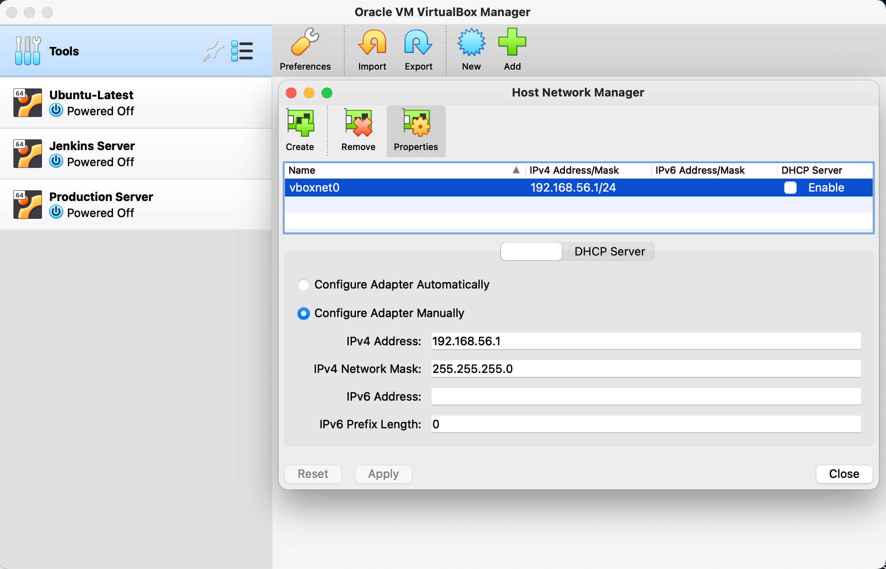
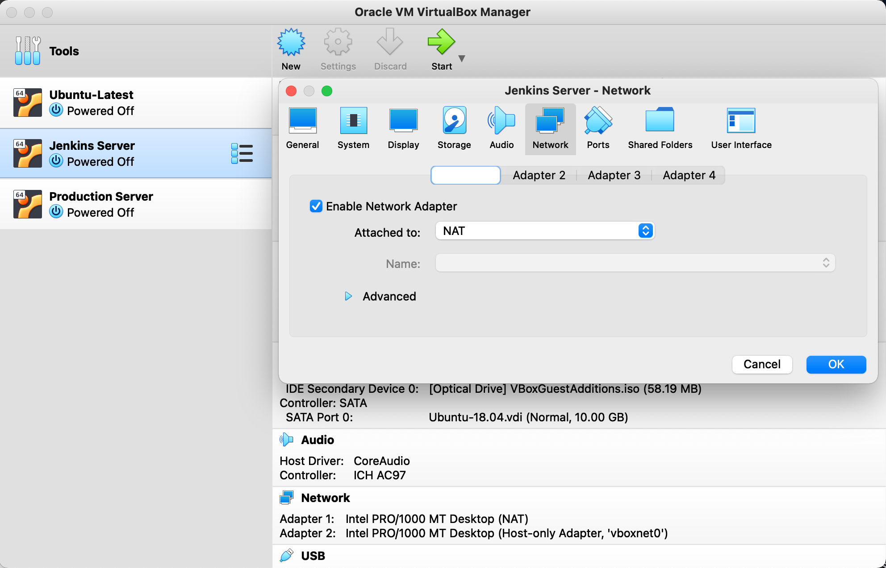
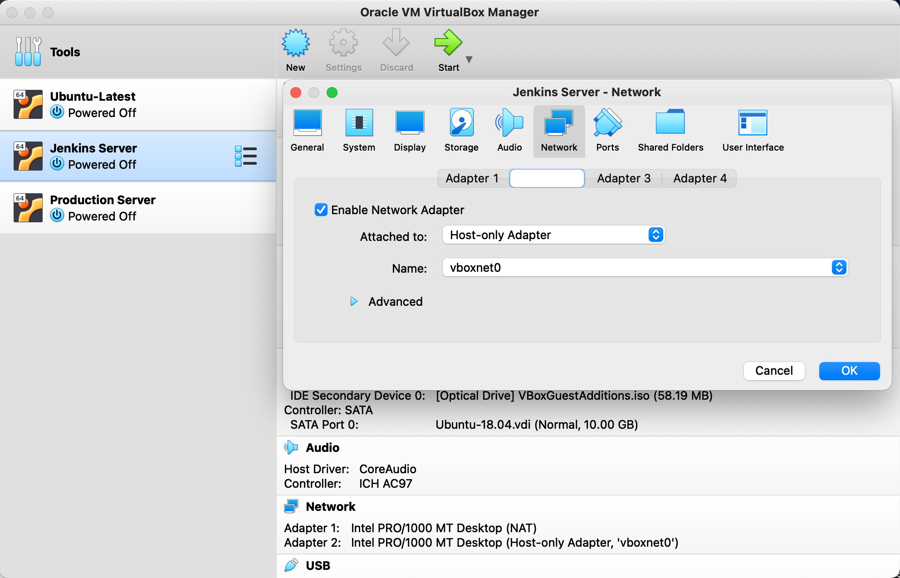

## **Objective**

The aim of this section is to set up VMs running Ubuntu Server.

### **Setting up VMs**
For the lab setup, I created 2 VMs running Ubuntu 18.04 LTS on VirtualBox. One VM is for Jenkins deployment and the other is a production server for deploying DVNA via Jenkins pipeline. 

I followed this [documentation](https://hibbard.eu/install-ubuntu-virtual-box/) upto `Up and Running with SSH` step, for installing Ubuntu on both the VMs. In the blog, they used a `Bridged` connection for enabling VM-to-VM and host-to-VM communication. Although this connection was initially working fine, the connectivity between the two VMs would very often get dropped for a couple of minutes. So to solve this issue, I instead used 2 adaptors; one for NAT and the other a Host-only network.

### **VM Network Configuration**
Open Virtual Box and go to `File` -> `Host Network Manager`. The `Host Network Manager` window will open, and ideally, a network named "vboxnet0" should exist with the DHCP server disabled. If it does not exist, you can create it by clicking on the "Create" button. The new network created will be named "vboxnet0" and ensure DHCP server is not enabled. This network will enable host-to-VM communication.



Now, open the **Oracle VM VirtualBox Manager**, click on the VM that you wish to configure for networking and go to the `Network` group. Follow this configuration steps for both the VMs (Jenkins and Production VMs, in my case) 

Adaptor 1 -> Click on `Enable Network Adapter` and in the **Attached** field, select NAT.


Adaptor 2 -> Click on `Enable Network Adapter` and make sure the fields are configured like this: **Attached to** - Host-only Adapter,  **Name** - vboxnet0.


We need each of the guest VMs to have a static IP address on the host-only network. Log in to your Ubuntu guest and type the following command.

```bash
ifconfig <interface> 192.168.56.101 netmask 255.255.255.0 up
```

Now you should be able to SSH into your VM from your host using this IP address. This is just temporary, however; once you reboot, this configuration will disappear. To make it permanent, add this to the .yml file in `/etc/netplan` directory (as `root`):
```bash
# This is the network config written by 'subiquity'
network:
  ethernets:
    enp0s3:
      dhcp4: true
    enp0s8:
      addresses: [192.168.56.101/24]
      nameservers:
        addresses: [1.1.1.1,8.8.8.8]
  version: 2
```

Before we apply the change, let’s test the configuration. To do that, issue the command:

```bash
sudo netplan try
```

The above command will validate the configuration before applying it. If it succeeds, you will see Configuration accepted and Netplan will attempt to apply the new settings to a running system. Should the new configuration file fail, Netplan will automatically revert to the previous working configuration.

If you are certain of your configuration file, you can skip the try option and go directly to applying the new options. The command for this is:

```bash
sudo netplan apply
```

Your setup should now be complete!
<br><br>
**Note: Fix for updating apt package repository**

After installing Ubuntu 18.04 LTS iso file and running two VMs using it, I tried to update all packages and their dependancies using  `sudo apt install update`. This, however, was not working and threw  errors. As my location was Kuwait, it tried reaching out to [https://kw.archive.ubuntu.com/](https://kw.archive.ubuntu.com/)..._ to find updates. But this archive server was not reachable.

To solve this issue, I changed all occurences of _[https://kw.archive.ubuntu.com/](https://kw.archive.ubuntu.com/)..._ to _[https://archive.ubuntu.com/](https://archive.ubuntu.com/)..._ in the `sources.list` file

```bash
sudo nano /etc/apt/sources.list
```

Your server should now be able to interact with the ubuntu archive server for updates and other packages.


